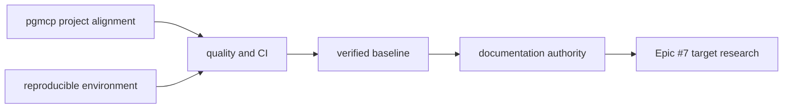

<!-- docs\development\issue1\research.md -->
<!-- template=research version=8b7bb3ab created=2026-08-17T10:31Z updated= -->
# Research: Reliable S1mpleTrader Development Control Plane

**Status:** APPROVED  
**Version:** 1.0  
**Last Updated:** 2026-08-17

---

## Purpose

Provide evidence-backed planning input for Epic #1. This document records the minimum mechanical conditions needed before fundamental S1mpleTrader product and architecture research can begin under Epic #7.

## Scope

**In Scope:**
Repository-local developer environment and dependency reproducibility; pgmcp v2 project configuration and GitHub taxonomy; executable quality gates and CI parity; current-state evidence collection; documentation authority classification; runtime/generated artifact policy; shared developer, agent, reviewer, and future-researcher validation surfaces.

**Out of Scope:**
Trading features; remediation of product-code defects; selection or revision of the S1mpleTrader target architecture; implementation of event, plugin, DTO, strategy, execution, data-provider, UI, or broker designs; external product or competitor research; task-level implementation plans, TDD cycles, estimates, and milestone commitments.

## Prerequisites

Read these first:

1. Epic #1 issue body and approved two-epic separation.
2. AGENTS.md and the active pgmcp epic research instructions.
3. docs/coding_standards/ARCHITECTURE_PRINCIPLES.md.
4. docs/coding_standards/DOCUMENTATION_STANDARD.md.
5. Repository evidence gathered on branch epic/1-development-control-plane.

---

## Problem Statement

S1mpleTrader does not yet provide a reproducible, measurable, and trustworthy development control plane. The local environment cannot execute the configured test suite, pgmcp quality checks can report success while selecting no project files, repository CI is absent, project-specific pgmcp configuration retains assumptions from its source repository, and existing documentation cannot safely be treated as an approved implementation contract. The initiative must establish reliable mechanical evidence without selecting or implementing a target product architecture.

## Research Goals

- Establish the observed mechanical blockers and their concrete repository surfaces.
- Identify candidate workstreams, shared validation surfaces, dependencies, and sequencing constraints.
- Separate observed facts from assumptions, planning questions, and future architecture decisions.
- Define an approved compatibility and migration strategy for the pgmcp v2 control-plane boundary.
- Define expected results that allow planning and later technical-baseline work to proceed without implementation bleed.

---

## Background

The repository combines a small Python backend foundation, a substantial historical and provisional documentation set, and a checked-in pgmcp v2 control plane derived from phase-gate-mcp. The user explicitly determined that the almost year-old and incomplete product design must not be implemented by default. Epic #1 therefore establishes mechanical trust only; Epic #7 remains the separate boundary for fundamental product research and target-architecture decisions. The user declined external research for Epic #1 because repository evidence is sufficient for this mechanical purpose.

---

## Findings

### Observed control-plane state

| Area | Observed evidence | Consequence for planning |
|---|---|---|
| Python environment | `.venv` runs Python 3.12.13. `pyproject.toml` declares Python `>=3.11`; the pgmcp Pyright gate requests Python 3.11. | Planning must define the supported Python policy before environment and CI configuration can converge. |
| Development tools | `pytest`, coverage, Ruff, mypy, and Pyright are declared as development extras but are absent from the active `.venv`. A full pgmcp test run exits before collection because pytest is unavailable. | A clean-checkout bootstrap and dependency reproducibility policy are prerequisites for credible test evidence. |
| Dependency reproducibility | No lockfile, requirements file, bootstrap script, `scripts/`, or setup guide exists. | Tool and dependency versions cannot currently be reproduced deterministically. |
| Quality selection | `.pgmcp/config/quality.yaml` selects `mcp_server/**/*.py` and `tests/mcp_server/**/*.py`, which do not exist. Project gates report success with file count zero and all gates skipped. | Quality configuration must target the real `backend/` and `tests/backend/` surfaces and define zero-file failure semantics. |
| Static analysis configuration | The quality configuration invokes `pyright --project pyrightconfig.json`, but `pyrightconfig.json` is absent. It also retains an MCP-server-specific type gate. | The authoritative Ruff, mypy, and Pyright policies remain planning questions. |
| CI | No `.github/` directory or CI workflow exists. | No branch or pull-request evidence currently verifies parity with local controls. |
| pgmcp project model | `.pgmcp/config/project_structure.yaml`, `quality.yaml`, `policies.yaml`, and `scopes.yaml` retain phase-gate-mcp source-repository paths or concepts. `artifacts.yaml` contains an empty `artifact_types` list. | Project-specific configuration and generic pgmcp v2 contracts must be distinguished explicitly. |
| GitHub taxonomy | Custom type, priority, phase, scope, and parent labels now exist because issue creation created them on demand. The original statement that only default labels exist is therefore partly stale. | Taxonomy still requires validation and S1mpleTrader-specific scope decisions, but label creation is no longer wholly absent. |
| Repository validation surfaces | The actual production and test roots are `backend/` and `tests/backend/`; pytest discovery points to `tests/backend`. There are 34 test files, but current pass and coverage claims cannot be executed. | The existing mirrored test layout is useful prior art once the environment and scopes are reliable. |
| Documentation authority | The docs tree mixes definitive, approved, implemented, preliminary, unresolved, living, and unlabelled documents. `ARCHITECTURE_GAPS.md` remains decision-heavy while navigation and implementation-status documents make currentness claims. | Status, provenance, and conflict handling must be explicit before the material is used by Epic #7. |
| Product-code discrepancies | Placeholders and contract drift are observable, including the `IStrategyCache.set_result_dto(producing_worker, result_dto)` contract versus the one-argument call in `FlowInitiator`. | Epic #1 records these facts but does not remediate or treat the old design as authoritative. |

### Candidate mechanical workstreams

| Workstream | Primary surfaces | Evidence-backed outcome boundary |
|---|---|---|
| pgmcp and GitHub alignment | `.pgmcp/config/*.yaml`, `.pgmcp/template_registry.json`, labels and parent linkage | S1mpleTrader paths and taxonomy work while generic pgmcp v2 lifecycle contracts remain compatible. |
| Reproducible environment | `pyproject.toml`, environment/bootstrap material, setup documentation | A clean checkout can establish the supported interpreter and required development tools. |
| Quality and CI | `.pgmcp/config/quality.yaml`, static-analysis configuration, CI workflows, quality documentation | Local, branch, project, and CI checks inspect the same intended files and cannot pass vacuously. |
| Verified current-state baseline | `backend/`, `tests/backend/`, configs, dependencies, runtime assets, implementation-status material | Actual results, gaps, placeholders, and mismatches are recorded without remediation. |
| Documentation authority | `AGENTS.md`, architecture/system/implementation navigation and status metadata | Historical and provisional evidence remains accessible but cannot masquerade as approved target architecture. |

### Dependencies and sequencing constraints

The pgmcp and environment workstreams are independent at research level but must converge on authoritative paths, interpreter versions, and tool versions. Quality and CI depend on both. A credible baseline depends on executable checks. Documentation classification depends on verified baseline evidence. Epic #7 remains downstream of the complete mechanical hand-over.

### Existing patterns and prior art

- `pyproject.toml` already provides package metadata, setuptools discovery, development dependency names, and pytest discovery; competing dependency SSOTs should not be introduced without explicit rationale.
- `.pgmcp/config/quality.yaml` already models distinct formatting, lint, import, line-length, mypy, and Pyright gates with structured output parsing; adaptation is preferable to an unrelated parallel quality runner.
- `.pgmcp/config/contracts.yaml` and `workphases.yaml` are the generic pgmcp v2 workflow SSOTs.
- `tests/backend/` mirrors backend boundaries and provides a candidate shared acceptance inventory once runnable.
- `DOCUMENTATION_STANDARD.md` provides the required separation among facts, assumptions, open questions, and decisions.

### Stakeholders and shared validation surfaces

- Developers and agents require deterministic clean-checkout setup without global-package dependence.
- `@co`, `@imp`, `@qa`, and pgmcp require valid paths, scopes, artifacts, labels, cached evidence, and stable v2 workflow behavior.
- Repository maintainers and PR reviewers require CI parity with authoritative local checks and transparent failures.
- Epic #7 researchers require a reliable code/test inventory and explicit documentation authority.

Shared validation surfaces include clean-checkout bootstrap, pytest collection and full execution, non-zero project-gate selection, branch-scope behavior, CI on pull requests and main, documentation navigation/link checks, and an explicit authority conflict rule.

### Risks and assumptions

- A green baseline could be manufactured by suppression or scope reduction; transparent failure reporting is therefore a research constraint.
- Mechanical issues could accidentally remediate product code or encode the old architecture; those actions remain out of scope.
- CI could drift from MCP/local checks if commands or configuration are duplicated.
- A Windows-only local setup could be mistaken for the supported platform policy.
- Imported pgmcp project configuration could be changed in ways that break generic v2 lifecycle behavior.
- Documentation classification could silently become architecture revision; preservation of provenance is required.
- This research assumes repository-local evidence is sufficient for Epic #1. External product and domain research is intentionally deferred to Epic #7.

## Open Questions

- ❓ Which Python version or version matrix is authoritative for local development and CI?
- ❓ Which dependency reproducibility mechanism is authoritative, and where are tool versions pinned?
- ❓ Which Ruff, mypy, and Pyright scopes and strictness levels define the initial quality policy?
- ❓ Should coverage be enforced immediately at a threshold or first recorded transparently as baseline evidence?
- ❓ How must project and branch quality runs behave when no files match?
- ❓ Is artifacts.yaml, template_registry.json, or another pgmcp v2 source authoritative for artifact discovery?
- ❓ Which generated pgmcp files remain tracked beyond the already approved policy for logs, temp files, and template_registry.json?
- ❓ Which S1mpleTrader scopes and documentation status vocabulary should planning adopt?
- ❓ Which documents, if any, remain binding beyond coding/workflow standards before Epic #7 approves a target architecture?

---

## Approved Strategy

Approved by the user on 2026-08-17.

| Boundary | Selected strategy | Rationale and constraint |
|---|---|---|
| Generic pgmcp v2 lifecycle and tool contracts | Preserve compatibility | `contracts.yaml`, `workphases.yaml`, tool schemas, lifecycle entry, cached resources, and role boundaries remain the control-plane foundation unless concrete incompatibility evidence requires an explicit later decision. |
| Imported phase-gate-mcp project assumptions | Clean break in project-specific configuration | Paths, scopes, quality selection, taxonomy, and project structure must describe S1mpleTrader rather than preserve irrelevant `mcp_server` assumptions. This may not encode or choose the future trading architecture. |
| Existing S1mpleTrader product code | Preserve as evidence during Epic #1 | Product defects, placeholders, and contract drift are recorded but not remediated under the mechanical epic. |
| Existing product and architecture documentation | Preserve provenance; temporary authority classification only | Documents remain research evidence. Epic #1 may classify status and conflicts but must not revise them into a target architecture. |
| Quality failures | Transparent baseline, no compatibility masking | Failures exposed after tool restoration are reported, not suppressed, waived, or silently fixed merely to obtain green status. Exact thresholds remain a planning decision. |
| pgmcp runtime artifacts | Approved selective tracking policy | `.pgmcp/logs/` and `.pgmcp/temp/` are ignored; `.pgmcp/template_registry.json` is tracked. Additional generated-file policy requires explicit evidence and planning. |
| External research for Epic #1 | Repository-only | The user determined that repository evidence is sufficient for mechanical planning. External product/domain research is deferred to Epic #7. |
| Transition to target-architecture research | Hard sequencing boundary | Epic #7 remains blocked until Epic #1 produces the reproducible baseline and documentation authority hand-over. |

---

## Expected Results

Epic #1 is successful when planning can define work without relying on unverifiable claims or stale product design:

- A clean checkout can reproduce the supported interpreter, dependencies, development tools, test collection, and verification commands.
- pgmcp v2 project configuration and GitHub taxonomy correspond to S1mpleTrader while generic lifecycle contracts remain demonstrably compatible.
- Project and branch quality runs select the intended non-zero file set and CI executes the same authoritative checks.
- Actual test, coverage, formatting, lint, import, line-length, mypy, and Pyright outcomes are recorded transparently.
- Product-code discrepancies are inventoried without remediation or architecture selection.
- Relevant documentation is classified with explicit provenance and conflict rules.
- The resulting hand-over supplies Epic #7 with verified facts, open questions, and boundaries rather than an inherited implementation mandate.

## Related Documentation
- **[AGENTS.md][related-1]**
- **[pyproject.toml][related-2]**
- **[.pgmcp/config/quality.yaml][related-3]**
- **[.pgmcp/config/project_structure.yaml][related-4]**
- **[.pgmcp/config/scopes.yaml][related-5]**
- **[.pgmcp/config/artifacts.yaml][related-6]**
- **[docs/coding_standards/ARCHITECTURE_PRINCIPLES.md][related-7]**
- **[docs/coding_standards/DOCUMENTATION_STANDARD.md][related-8]**
- **[docs/architecture/ARCHITECTURE_GAPS.md][related-9]**
- **[docs/implementation/IMPLEMENTATION_STATUS.md][related-10]**

<!-- Link definitions -->

[related-1]: ../../../AGENTS.md
[related-2]: ../../../pyproject.toml
[related-3]: ../../../.pgmcp/config/quality.yaml
[related-4]: ../../../.pgmcp/config/project_structure.yaml
[related-5]: ../../../.pgmcp/config/scopes.yaml
[related-6]: ../../../.pgmcp/config/artifacts.yaml
[related-7]: ../../coding_standards/ARCHITECTURE_PRINCIPLES.md
[related-8]: ../../coding_standards/DOCUMENTATION_STANDARD.md
[related-9]: ../../architecture/ARCHITECTURE_GAPS.md
[related-10]: ../../implementation/IMPLEMENTATION_STATUS.md

---

## Version History

| Version | Date | Author | Changes |
|---------|------|--------|---------|
| 0.1 | 2026-08-17 | Agent | Initial draft |
| 1.0 | 2026-08-17 | User / Agent | Research scope and strategy approved |